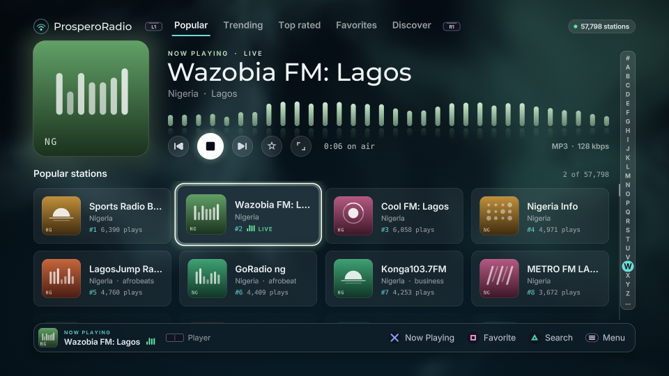

<p align="center">
  
</p>

<h1 align="center">ProsperoRadio</h1>

<p align="center">
  <strong>A native Internet-radio application for PlayStation 5 homebrew</strong><br>
  Browse and search the Radio Browser catalogue with resilient disk-backed
  caching, native PS5 audio playback, and a controller-first OpenGL interface.
</p>

<p align="center">
  <a href="https://github.com/blackbearreloaded/ProsperoRadio/actions/workflows/tooling.yml"></a>
  <a href="https://github.com/blackbearreloaded/ProsperoRadio/releases/latest"></a>
  <a href="LICENSE"></a>
</p>



The picture shows ProsperoRadio running on a PlayStation 5 with a station on air.

## Highlights

- Browse more than 56,000 supported stations in a validated Radio Browser
  sync; the live total changes as the public catalogue evolves.
- Explore 240 countries and hundreds of genres and languages with server-side
  paging, search, and on-demand filters.
- Play AAC/AAC+, MP3, and Opus through native PS5 decoder paths, with validated
  Vorbis, FLAC, and Ogg-FLAC fallbacks.
- Resolve audio-only AAC HLS, M3U/PLS playlists, and ICY metadata while
  recovering cleanly from malformed or interrupted streams.
- Keep the catalogue and favourites fast and persistent in SQLite under
  `/data/prosperoradio`, with atomic refreshes and Radio Browser mirror failover.
- Use a controller-first OpenGL interface built on
  [ps5-homebrew-ui](https://github.com/blackbearreloaded/ps5-homebrew-ui):
  a Now Playing view with a visualizer, a letter rail on every station list,
  sound controls (volume, bass, treble, balance), PS5 text input, and station
  names in every script.

## Project foundations

> [!IMPORTANT]
> **Built on the [PS5 Native App Boilerplate](https://github.com/blackbearreloaded/ps5-native-app-boilerplate).**
> ProsperoRadio preserves the template's modern C++20 structure, `.hpp` interfaces,
> reproducible runtime, FSELF tooling, tests, deployment flow, and release
> automation.

> [!WARNING]
> **Filesystem access comes from [PS5-Lapy-JB-Daemon](https://github.com/blackbearreloaded/PS5-Lapy-JB-Daemon).**
> The PS5 jailbreak environment must provide a local ELF loader on TCP port
> 9021. If a resident Lapy service is running it is used; otherwise
> ProsperoRadio sends its own packaged, title-specific upstream Lapy helper over
> that local connection. No separate Lapy payload is required for normal use,
> and ProsperoRadio contains no kernel code of its own. Without either, the app
> still runs, with its data in its sandbox (`/download0`). See
> [`src/elevation/README.md`](src/elevation/README.md).

> [!IMPORTANT]
> **The interface is built on [ps5-homebrew-ui](https://github.com/blackbearreloaded/ps5-homebrew-ui).**
> The kit is a build dependency, not part of this repository: the build
> fetches a pinned commit of it, the pinned
> [ps5-opengl](https://github.com/blackbearreloaded/ps5-opengl) SDK and the
> pinned HarfBuzz source into `.deps/`. See [`ui-kit/README.md`](ui-kit/README.md).

> [!IMPORTANT]
> **Audio work is documented in [PS5 Audio Decoding Research](https://github.com/blackbearreloaded/ps5-audio-decoding-research).**
> The companion repository records the hardware-first decoder investigation,
> reverse-engineering notes, native API probes, codec boundaries, and device
> validation that informed ProsperoRadio's audio implementation.

| Identity | Value |
| --- | --- |
| Shell title | `ProsperoRadio` |
| Title ID | `PPSA99001` |
| Category | Media |
| Current release version | `01.000.010` |
| Release-version source | [`sce_sys/param.json`](sce_sys/param.json) |
| Writable data | `/data/prosperoradio` |

## Features

- Browse Popular, Trending, Top rated, Favorites, and Discover views.
- Search live Radio Browser data by text, country, genre, language, and
  bitrate, with mirror failover and server-side paging.
- Keep a large SQLite catalogue and favourites on `/data/prosperoradio`; a failed sync
  leaves the last verified catalogue untouched.
- Navigate entirely with the DualSense D-pad or left analogue stick; the PS5
  IME handles text entry.
- Draw station names in every script (Arabic, Cyrillic, Chinese, Persian and
  more) with the console's own fonts, HarfBuzz shaping and right-to-left
  ordering.
- Update from inside the app: when [homebrew.page](https://homebrew.page)
  lists a newer release, ProsperoRadio offers to install it each time it
  opens; **Skip** keeps the current version. See [Updating](#updating).
- Keep everything it writes in one place outside the app folder,
  `/data/prosperoradio`, so an update never touches it. See
  [Where ProsperoRadio keeps its files](#where-prosperoradio-keeps-its-files).
- Play AAC/AAC+ and MP3 through native PS5 decoding; play Opus through the
  native Opus/CELT decoder route; play Vorbis and FLAC/Ogg-FLAC with bounded
  CPU decoders.
- Resolve bounded M3U/PLS indirection, strip ICY metadata, and support the
  audio-only AAC HLS subset.

App-specific codec limits and validation are documented in
[Architecture](docs/ARCHITECTURE.md),
[Codec investigation](docs/CODEC_INVESTIGATION.md), and
[Roadmap](ROADMAP.md). The complete reusable research record lives in
[PS5 Audio Decoding Research](https://github.com/blackbearreloaded/ps5-audio-decoding-research).

## Requirements

Build from Linux, WSL, or a Linux CI runner. On Ubuntu, Debian, or WSL:

```bash
sudo apt update
sudo apt install curl git make pkg-config python3 python3-venv tar unzip wget zip \
  clang-18 clang-format-18 clang-tidy-18 lld-18 libsqlite3-dev
```

The
repository downloads, verifies, and caches the public PS5 Payload SDK, zlib,
PacBrew's SQLite and libcurl ports, the interface kit, the ps5-opengl SDK,
HarfBuzz, the pinned upstream Lapy helper sources, GoogleTest, and packaging
tools below ignored `.deps/`.
No proprietary SDK, system module, key, or game asset is included or fetched.

Run a read-only prerequisite check before building:

```bash
make doctor
```

See [Getting started](docs/GETTING_STARTED.md) and
[Native tooling](docs/NATIVE_TOOLING.md) for build-environment detail.

## Build

`sce_sys/param.json` is the only identity and release-version source. Do not
change `PPSA99001` when updating ProsperoRadio: changing it produces a separate PS5
title rather than an update.

```bash
make
```

The output is the complete title folder:

```text
dist/PPSA99001/
```

Releases are that folder as one file, `PPSA99001.zip`, with its `SHA256SUMS`.
A release ZIP built by the workflow can be checked with
`gh attestation verify PPSA99001.zip -R blackbearreloaded/ProsperoRadio` (GitHub CLI); this covers
releases built by GitHub Actions from now on, not earlier ones.
The ZIP is the only release file: the app updates itself in place, and
that needs a folder install.

An optional local UFS2 `.ffpkg` target remains available for development; it
is intentionally excluded from CI and GitHub Releases. See
[Package formats](docs/FFPKG.md).

The app is a **Media** category title. Stage the whole folder, not `eboot.bin`
alone. For a local development loop against an already-running FTP service:

```bash
make deploy PS5_HOST=192.168.4.30 DEPLOY_FORMAT=folder
```

> [!NOTE]
> The first launch can take a while while ProsperoRadio downloads, validates, and
> caches the Radio Browser catalogue. Keep the console online and leave the app
> open until the database finishes loading; later launches use the local cache.

## Where ProsperoRadio keeps its files

The app itself stays in `/data/homebrew/PPSA99001` (or wherever ShadowMountPlus
mounts it from). Everything it writes is in `/data/prosperoradio`:

```text
/data/prosperoradio/
├── config/     settings.txt, the favourites, the update check's sequence number
├── catalog/    the station catalogue (rebuilt by a refresh)
└── logs/       prosperoradio.log and the previous session's
```

Favourites and the catalogue an earlier version kept in its sandbox are copied
over on the first start. Without filesystem access (no resident Lapy service
and no ELF loader on port 9021) the same files stay in the title's sandbox,
`/download0`, as in release 01.000.005.

## Updating

### From the app

When a newer release is listed on [homebrew.page](https://homebrew.page),
ProsperoRadio says so each time it opens:

- **Update now** downloads the release ZIP from its GitHub release, checks it
  against the SHA-256 in the catalog's signed list, and unpacks it beside the
  app. A ring shows how far it is and the time left; Circle cancels, and nothing
  has changed until the end. Then ProsperoRadio closes, the update helper
  (`self-updater.elf`, sent to the console's payload loader on port 9021)
  replaces the app's files, and the console shows a notification. Open
  ProsperoRadio again to use the new version.
- **What's new** (or Triangle) shows the release's notes, when it has any,
  in a view that scrolls; **Update now** is there too.
- **Skip** keeps the current version until the next time the app opens.

Your favourites, settings and catalogue are in `/data/prosperoradio`, outside
the app, so an update keeps them; files you put in the app folder yourself stay
too. If the download or the unpacking fails, the dialog says why and offers
**Try again**; the app stays as it was. Without a network, or without an
answer, nothing is shown. When ProsperoRadio cannot install the release itself
(for example a copy installed as an image, which the helper does not rewrite),
a notice at the top right says **Update available** for ten seconds
instead, and the manual steps below still work.

### By hand

1. Fully close ProsperoRadio.
2. From the
   [latest release](https://github.com/blackbearreloaded/ProsperoRadio/releases/latest),
   download `PPSA99001.zip`.
3. Extract it locally, then upload the entire `PPSA99001/` folder over FTP so
   its destination is `/data/homebrew/PPSA99001/`, and wait for the transfer to
   finish. Do not upload the ZIP file itself.
4. If an earlier release was installed as `/data/homebrew/PPSA99001.ffpfsc`,
   remove that image: do not keep it beside the folder. Restart ShadowMountPlus
   cleanly or restart the PS5.
5. Start the approved services normally, wait for ShadowMountPlus to
   rediscover `PPSA99001`, then launch ProsperoRadio and confirm the version
   shown below the app name.

Do not relaunch immediately after replacing the app: ShadowMountPlus may
still have the previous folder mounted. The catalogue, favourites
and settings are in `/data/prosperoradio`, outside the app, so they are kept;
Shell presentation metadata may remain cached.

The deployer writes only title-scoped paths below `/data/homebrew`. It uploads
each file through a temporary name, then publishes `eboot.bin` and
`sce_sys/param.json` last. For console protocol and evidence requirements, see
[Deployment](docs/DEPLOYMENT.md) and [Testing](docs/TESTING.md).

## Test and quality gates

```bash
make test            # C++ unit tests, UI/metadata tests, 16 codec/catalogue checks
make lint            # formatting, static analysis, metadata, and shell checks
make check           # lint + all host tests + complete folder build
```

The test suite runs entirely on the host and never contacts a console. It
covers RML/UI asset consistency, catalogue persistence, mirror/query parsing,
AAC timing, MP3 framing, ICY metadata, PCM/retry behaviour, Ogg/Opus,
Vorbis, FLAC, HLS/MPEG-TS, controller input, and Arabic/RTL text ordering.
The PS5-only boundary is documented in [Testing](docs/TESTING.md).

For pull requests and version tags, GitHub Actions runs linting, every host
test, deterministic runtime reproduction, and the app-folder build. A push to
`main` builds nothing: start a build there by hand (**Actions**, **Build**,
**Run workflow**). When an exact `contentVersion` tag is
pushed, the workflow archives that folder, verifies the archive, and publishes
`PPSA99001.zip` with its `SHA256SUMS` file. Every pull request gets an
installable build named by its number and commit: see
[Pull-request builds](docs/PULL_REQUEST_BUILDS.md).

## Source layout

```text
src/main.cpp                  Application lifetime, renderer, fonts, and the frame loop
src/app/                      The interface: screens, session state, platform seam
src/radio_http_curl.cpp       The service's HTTP calls on libcurl
src/elevation/                Filesystem access: the client of upstream Lapy
src/update_kit/               The self-update kit's sources, compiled as the app's
ui-kit/                       What the app takes from ps5-homebrew-ui and lays over it
src/radio_text.cpp            C++20 UTF-8 visual-order helper
src/*.hpp                     Private C++ application interfaces
include/*.hpp                 Public codec, catalogue, input, and service interfaces
vendor/                       Checked-in SDL2, decoder, stb, and PS5 SDK inputs
third_party/update_check/     The update check and self-update of the PS5 Native App Boilerplate
third_party/self_update_helper/  The payload that replaces the app's files (self-updater.elf)
tests/console/                Scripted console runs for tools/console-run.py
tools/build.sh                Template-native compile/link/FSELF/folder assembler
tooling/native/               Template-owned native ELF and FSELF tooling
tests/                        GoogleTest and Python integration regressions
sce_sys/param.json            Shell metadata, title identity, and release version
docs/                         Architecture, testing, codec, build, and deployment documentation
```

ProsperoRadio is a C++20 application throughout. Repository-owned interfaces use the
boilerplate's `.hpp` convention; portable codec, demux, persistence, input, and
service modules are independently testable C++ translation units. Vendored
single-file decoders retain their upstream filenames and are compiled through
small C++ adapters. See [Template port notes](docs/TEMPLATE_PORT.md).

## Versioning and releases

`contentVersion` in [`sce_sys/param.json`](sce_sys/param.json) drives the
packaged metadata, top-bar UI version, Git tag, and GitHub Release name. It
uses PS5's exact `NN.NNN.NNN` format without a `v` prefix.

```bash
# After updating sce_sys/param.json and passing the local gates.
git tag 01.000.005
git push origin main 01.000.005
```

The workflow rejects a mismatched tag. Full field meanings, Game/Media
metadata, and the import-linking configuration are in
[Configuration](docs/CONFIGURATION.md).

<!-- bbr-footer:start -->
<!-- Generated by ps5-homebrew-dev-protocol/scripts/readme-footer. Edit the template there, not here. -->

## Credits

Built with the [PS5 Payload SDK](https://github.com/ps5-payload-dev/sdk) by John Törnblom (ps5-payload-dev).
Third-party components, authors and licenses are listed in
[THIRD_PARTY_NOTICES.md](THIRD_PARTY_NOTICES.md).

## License

Copyright © 2026 BlackBearReloaded. Licensed under GPL-3.0-or-later; see [LICENSE](LICENSE). Third-party components keep their own licenses. Binary releases are built from the tagged source in this repository.

## Disclaimer

- **No affiliation.** This is an independent homebrew project. It is not
  affiliated with, endorsed by, or sponsored by Sony Interactive Entertainment.
  "PlayStation", "PS5" and related marks are trademarks of Sony Interactive
  Entertainment Inc. This project is not affiliated with or endorsed by Radio Browser.
- **No proprietary material.** No Sony SDK, firmware, encryption keys or
  decrypted system modules are included.
- **No warranty.** This project is provided "as is", without warranty of any
  kind, to the extent permitted by law. See sections 15 and 16 of the GPL.
- **Use at your own risk.** Running homebrew requires a modified console, which
  may void its warranty, breach the platform's terms of service, or cause data
  loss.
- **Legal use only.** Use it only with hardware, accounts and content you own.
  This project does not support or enable piracy.

## AI assistance

This project was developed with AI assistance from OpenAI and/or Anthropic tools.
<!-- bbr-footer:end -->
